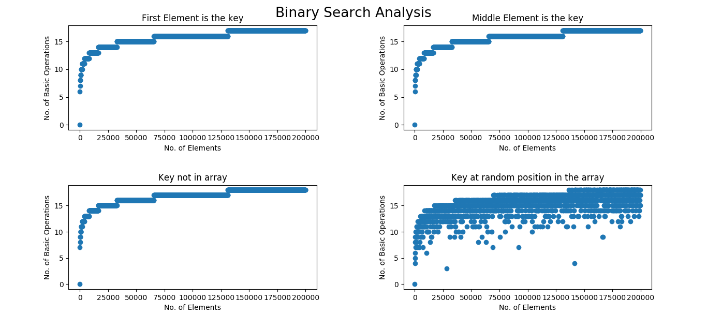
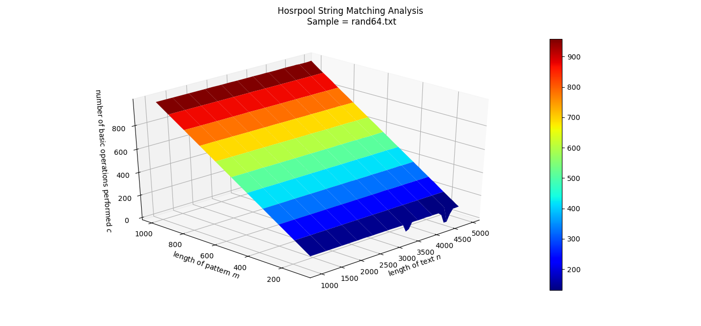

# openanalysis
In our daily life, we encounter many algorithms. Knowingly or Unknowingly, algorithms make our life easier. Analysis of algorithms is a special field of interest in Computer Science. Analysis evaluates the algorithm, and leads to invention of faster algorithms. Visualization leads to the better understanding of how algorithms work. The package OpenAnalysis is inteded as a tool for analyzing and visualizing algorithms.

## Supported Kinds of algorithms

- Searching
- Sorting
- String Matching
- Tree Growth Based Graph Algorithms
- Matrix based Dynamic Programming Graph Algorithms
- Tree like Data Structure analysis and visualization

## Samples Showcase
Here we present the sample images and videos generated by our tools.

Look for the videos under [_static](./_static) directory as `.md` files doesn't support embedded videos
